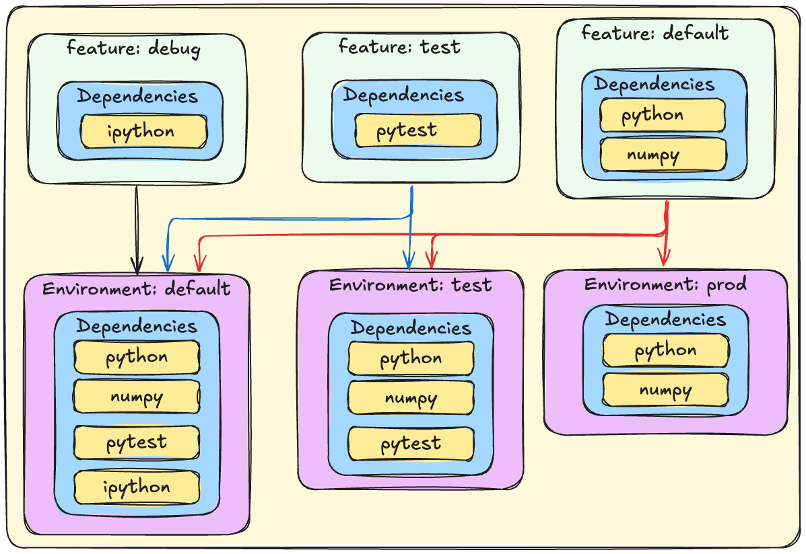

# Pixi: Introduction


Pixi is a cross-platform package manager that can manage complex development workflows.

There are two main features:
- Installing tools globally (`pixi global`)
- Project workflow

# What does Pixi solve?
Pixi's goal is to solve fast reproducible developer and deployment workflows.
Often written as *"it worked on my machine"*.
Pixi gives the developer all the required tools to create an environment that they can share with colleagues and servers.
While being sure there is nothing missing from the environment to run the project.

There are some key focus points to solve this problem.

1. **Reproducibility**: Pixi always locks all packages it installs into the environments into a lockfile
2. **Speed**: By using modern technologies like Rust and a big focus on optimizations, Pixi is using as much of the machines capabilities to do it's work as fast as possible.
3. **Virtualization**: By separating environments in dedicated folders, users can easily set up, build, and test a project without worrying about their other projects break in the meantime.
4. **{term}`Cross-Platform`**: With everything Pixi can do it tries to bridge the gaps between the different operating systems, making collaboration easier than before.
5. **{term}`Cross-Language`**: While Python is well-supported language, Pixi doesn't stop there, it also focusses on C/C++, CUDA, Rust, Fortran and more.


All of these points are wrapped in a set of main functionalities.

1. **Virtual environment Management**: Pixi can create conda environments and activate them on demand.
2. **Package management**: Pixi can install/update/upgrade/remove packages from these environments
3. **Task management**: Pixi has a cross-platform task runner built-in, allowing users to share the same commands on all platforms.

We'll dive deeper into these topics later on.

# The project workflow
Pixi is designed to be used in a project-based workflow.
Tools like `poetry`, `uv`, `npm`, `deno`, `cargo`, `maven` and `pixi` are all designed to be used in a project-based workflow.
This means that you can create a project and then use Pixi to manage the dependencies and tasks for that project.
You can think of a project as a self-contained directory that contains all the files and configurations needed to build and run your application.
Often the project will keep the environment it installs close to the project folder itself, so it will not clutter the system.
This is a great way to keep your projects organized and to avoid conflicts between different projects.

### Project-based vs Environment-based vs System-based
To give a little background why Pixi is designed this way, let's take a look at the different ways to manage packages and environments.

::::{tab-set}
:::{tab-item}Project-based workflow
**Supporting tools:** `pixi`, `poetry`, `uv`, `npm`, `deno`, `cargo`, `maven`

**Pros:**
- Isolated environments per project (no conflicts)
- Easy to reproduce and share with others (declarative)
- Keeps dependencies close to the project

**Cons:**
- Can use more disk space (multiple environments)
- Slightly more setup per project
:::
:::{tab-item}Environment-based workflow
**Supporting tools:** `conda`, `mamba`, `micromamba`, `pip`, `pipenv`, `uv pip`

**Pros:**
- Easy to share environments across multiple projects
- Isolated environments (no conflicts)

**Cons:**
- Risk of dependency conflicts between projects
- Harder to reproduce exact environments later

:::
:::{tab-item}System-based workflow
**Supporting tools:** `apt`, `rpm`, `brew`, `choco`, `winget`, `scoop`, `flatpak`

**Pros:**
- Simple, everything installed globally
- Every OS has a default package manager
- Guaranteed to work with system libraries

**Cons:**
- Very High risk of dependency/version conflicts with other projects (especially Python)
- Hard to reproduce or share setups
- Limited flexibility when it comes to versions
:::
::::


# Creating a project
As Pixi uses the project-based workflow, it uses a manifest file to keep track of the dependencies and tasks for the project.
This is also known as **declarative** configuration, where you describe what you want, and Pixi will take care of the rest.
The manifest file is called `pixi.toml`, or you can use `pyproject.toml`, and it is located in the root of the project.


To create a new project, you can use the `pixi init` command.
::::{tab-set}
:::{tab-item}pixi.toml
```bash
pixi init my_project
```
This will create a new directory called `my_project` and initialize a new `pixi.toml` file in it.
```bash
my_project
├── .gitattributes
├── .gitignore
└── pixi.toml
```

The `pixi.toml` file is a {term}`TOML` file that contains the configuration for the project.

```{code} toml
:filename: pixi.toml
:linenos:

[workspace]
authors = ["Jane Doe <jane.doe@example.com>"]
channels = ["https://prefix.dev/conda-forge"]
name = "my_project"
platforms = ["osx-arm64"]
version = "0.1.0"

[tasks]

[dependencies]
```

The `pixi.toml` doesn't have the basic Python package structure like the `pyproject.toml` file, because it is not a Python package by default.

As `pixi.toml` has a JSON schema, it is possible to use IDE's like VSCode to edit the field with autocompletion.
Install the [Even Better TOML](https://marketplace.visualstudio.com/items?itemName=tamasfe.even-better-toml) VSCode extension to get the best experience. Or use the integrated schema support in PyCharm.

:::

:::{tab-item}pyproject.toml
```bash
pixi init my_pyproject --format pyproject
```
This will create a new directory called `my_pyproject` and initialize a new `pyproject.toml` file in it.
It will also create a `src` directory with a `my_pyproject` subdirectory and an `__init__.py` file in it, to make it a simple Python package.
```bash
my_project
├── .gitattributes
├── .gitignore
├── pyproject.toml
└── src
    └── my_pyproject
        └── __init__.py
```

The `pyproject.toml` file is a {term}`TOML` file that contains the configuration for the project.

```{code} toml
:filename: pyproject.toml
:linenos:
[project]
authors = [{name = "Jane Doe", email = "jane.doe@example.com"}]
dependencies = []
name = "my_pyproject"
requires-python = ">= 3.11"
version = "0.1.0"

[build-system]
build-backend = "hatchling.build"
requires = ["hatchling"]

[tool.pixi.workspace]
channels = ["https://prefix.dev/conda-forge"]
platforms = ["osx-arm64"]

[tool.pixi.pypi-dependencies]
my_pyproject = { path = ".", editable = true }

[tool.pixi.tasks]
```
Note that the `pyproject.toml` file is a little different from the `pixi.toml` file.
The `pyproject.toml` file is a standard file used by many Python tools, thus it makes it easier to share the project with others.
The only difference between the two files is that the `pyproject.toml` file has a `[tool.pixi` prefix to the Pixi specific sections.
:::
::::

For the rest of this tutorial, we will use the `pixi.toml` file as the main file.

# Managing dependencies
After creating the project, you can start adding dependencies to the project.
Pixi uses the `pixi add` command to add dependencies to the project.
This command will , by default, add the conda dependency to the `pixi.toml` or `pyproject.toml` file, solve the dependencies, write the lockfile and install the package in the environment. e.g. lets add `numpy` and `pytest` to the project.
```bash
pixi add numpy pytest
```
This will result in the following manifest file:

```{code} toml
:filename: pixi.toml
:linenos:
:emphasize-lines: 11
[workspace]
authors = ["Jane Doe <jane.doe@example.com>"]
channels = ["https://prefix.dev/conda-forge"]
name = "my_project"
platforms = ["osx-arm64"]
version = "0.1.0"

[tasks]

[dependencies]
numpy = ">=2.2.6,<3"
pytest = ">=8.3.5,<9"
```

If you want a specific version of a package, you can specify the version in the command.
```bash
pixi add numpy==2.2.6 pytest==8.3.5
```
Or you can make it more specific by using multiple types of specifiers.
For the versions you can use the following specifiers:
- `==`: Exact version, e.g. `numpy==2.2.6`
- `>=`: Minimum version, e.g. `numpy>=2.2.6`
- `<=`: Maximum version, e.g. `numpy<=2.2.6`
- `>`: Greater than version, e.g. `numpy>2.2.6`
- `<`: Less than version, e.g. `numpy<2.2.6`
- `!=`: Not equal to version, e.g. `numpy!=2.2.6`
- `~=`: Compatible release, e.g. `numpy~=2.2.6` (equivalent to `>=2.2.6, <3`)

All of these specifiers can be combined, e.g. `numpy>=2.2.6,<3`, or `numpy~=2.2.6,!=2.2.7`.

For the `[dependencies]` section, Pixi supports the conda MatchSpec format, which includes:
| Field| Example | Comment |
|---|---|---|
| `name` | `numpy = "*"` |The name of the package, without the version specifier |
| `version` | `numpy = ">=2.2.6,<3"` <br> `numpy = {version = "==2.2.6"}` | The version specification of the package. |
| `build` | `numpy = {build = "py39h1234567_0"}` | The build string of the package |
| `build_number` | `numpy = {build_number = 0}` | The build number of the package |
| `channel` | `numpy = {channel = "conda-forge"}` | The channel where to get the package from (must be defined in `[workspace]`) |
| `license` | `numpy = {license = "BSD-3-Clause"}` | The license of the package |

## PyPI dependencies
Pixi can also install packages from PyPI, it does this through it's integration with `uv`.
In the Rust code Pixi depends on the `uv` package manager to install the packages from PyPI.
This means that you can use the `pixi add --pypi` command to install packages from PyPI.

```bash
pixi add --pypi pydantic
```

Which results in it being added to the manifest file as:
::::{tab-set}
:::{tab-item}pixi.toml
In the `pixi.toml` file, it will be added to the `[pypi-dependencies]` section.
```{code} toml
:filename: pixi.toml
:linenos:
[pypi-dependencies]
pydantic = ">=2.11.5, <3"
```
:::
:::{tab-item}pyproject.toml
In the `pyproject.toml` file, it will be added to the `[project]` section in the normal case.
```{code} toml
:filename: pyproject.toml
:linenos:
[project]
# ...
dependencies = ["pydantic>=2.11.5,<3"]
```
Things like `path` and `editable` are added through the Pixi specific section.
For example:
```{code} toml
:filename: pyproject.toml
:linenos:
[tool.pixi.pypi-dependencies]
my_pyproject = { path = ".", editable = true }
```
:::
::::


What pixi does differently from managing PyPI packages through other package managers, is that it will install the packages in the same environment as the conda packages, but will not overwrite the conda packages.
We've got a mapping between the conda packages and the PyPI packages, so that we can let `uv` know which packages to install and which packages to ignore because they are already installed.

::: {note} Pixi doesn't install `uv`!
While Pixi uses `uv` to install the PyPI packages, it doesn't install `uv` itself.
So you cannot us `uv` directly in the project, without installing it first.
:::

### Special types of dependencies
Pixi has a few special types of dependencies that you can use in the project.

| Type | Description | Example |
|---|---|---|
| `git` | Install a package from a git repository | `git = "https://github.com/user/repo.git"`|
| `branch` | Install a specific branch from a git repository (requires `git`) | `branch = "main"` |
| `tag` | Install a specific tag from a git repository (requires `git`)| `tag = "v1.0.0"` |
| `rev` | Install a specific commit from a git repository (requires `git`) | `rev = "abc123"` |
| `path` | Install a package from a local directory | `path = "./local-python-package"` |
| `editable` (`pypi` only) | Install a package in editable mode | `editable = true` |
| `url` | Install a package from a URL | `url = "https://example.com/package.whl"` |


## Lockfile
The lockfile is a file that contains the exact versions of the packages that were installed in the environment.
This file is used to ensure that the same versions of the packages are installed in the environment when the project is shared with others.
What should you know about the lockfile?
- The lockfile is called `pixi.lock` and is located in the root of the project, next to the `pixi.toml` or `pyproject.toml` file.
- The lockfile is a YAML file that contains the exact versions of the packages that were installed in the environment.
- The lockfile is automatically (re-)generated when you `add`, `remove`, `update` a package in the project, or when you run `pixi install/run/shell/lock` and it's not existing yet.
- The lockfile is meant to be shared with others, so that they can reproduce the same environment.
- The lockfile is not meant to be edited manually, as it is automatically generated by Pixi.

```{code} yaml
:filename: pixi.lock
:caption: Example lockfile, highly simplified for readability
:linenos:
version: 6
environments:
  default:
    channels:
    - url: https://prefix.dev/conda-forge/
    indexes:
    - https://pypi.org/simple
    packages:
      osx-arm64:
      - conda: https://prefix.dev/conda-forge/osx-arm64/bzip2-1.0.8-h99b78c6_7.conda
      - pypi: ...
packages:
- conda: https://prefix.dev/conda-forge/osx-arm64/bzip2-1.0.8-h99b78c6_7.conda
  sha256: adfa71f158cbd872a36394c56c3568e6034aa55c623634b37a4836bd036e6b91
  md5: fc6948412dbbbe9a4c9ddbbcfe0a79ab
  depends:
  - __osx >=11.0
  license: bzip2-1.0.6
  license_family: BSD
  size: 122909
  timestamp: 1720974522888
- pypi: ...
```


# Managing tasks
Pixi has a built-in {term}`cross-platform` task runner that allows you to define tasks in the manifest.
This is a great way to share tasks with others and to ensure that the same tasks are run in the same environment.
The tasks are defined in the `[tasks]` section.

## Basic tasks

You can use the `pixi task` command to modify the tasks in the project.
```bash
pixi task add hello "echo Hello World"
```
This will add a new task called `hello` to the project, which will print `Hello World` to the console.
```{code} toml
:filename: pixi.toml
:linenos:
[tasks]
hello = "echo Hello World"
```
You can also use the `pixi run` command to run the tasks in the project.
```bash
pixi run hello
```
This will run the `hello` task and print `Hello World` to the console.

# Environments
Now you know the basics of dealing with the Pixi manifest basics.
Next step is actually use the environments it can create for you.

## Activating environments
Because Pixi creates virtual environments for you, it is important to activate the environment before running any commands.
You can do this by using the `pixi shell` or the `pixi run` command, these commands will automatically activate the environment for you.

```bash
pixi run python -VV
# or:
pixi shell
python -VV
exit
```

Activating an environment is not alot more than running a script that sets the environment variables for you.
To investigate this, you can use `pixi shell-hook` to view what the shell script looks like.
```bash
pixi shell-hook
```
This will print the shell script that is used to activate the environment.


## Multiple environments
Pixi can create multiple environments for you, so you can easily switch between them.
This is similar to how `conda` works, but Pixi keeps them specific to the project.

:::{note} Multi environment feature as if it was LEGO.
:class: dropdown
Pixi helps you make different LEGO sets (`environments`) using bags of parts (`feature`s). You can reuse parts for multiple sets without copying them.

LEGO sets (`environments`):
- One set is for playing (has lots of fun tools).
- One set is for testing (has only what you need to check if stuff works).
- One set is for shipping (super clean, just what’s needed to run).

Bags of parts (`features`):
- One bag has all the tools you need to play.
- One bag has all the tools you need to test.
- One bag has all the tools you need to ship.

By combining these bags, you can make all the different LEGO sets you want.
Keeping every set clean and tidy, without duplicating the parts around.
:::

The best way to explain this is to give an example.

```{code} toml
[dependencies] # Read this as `[feature.default.dependencies]`
python = ">=3.11,<3.12"
numpy = "*"

[feature.test.dependencies]
pytest = ">=8.3.5,<9"

[feature.format.dependencies]
ruff = "*"

[feature.debug.dependencies]
ipython = "*"

[environments]
# A development environment with all the tools to play with, overwriting the default environment
default = {features = ["test", "debug", "format"], solve-group = "default"}

# A testing environment with only the tools to test, great for CI
test = {features = ["test"], solve-group = "default"}

# A production environment with only the tools to run the code
# The default feature is always included, so you don't need to specify it
prod = {features = [], solve-group = "default"}

# A minimal environment with only the tools to format the code
format = { features = ["format"] , no-default-feature = true }
```
This will create the following environments:

| Environment | Features | Dependencies | Solve Group |
| --- | --- | --- | --- |
| `default` | `test`, `format`, `debug`, `default` | `python`, `numpy`, `pytest`, `ruff` | default |
| `test` | `test`, `default` | `python`, `numpy`, `pytest` | default |
| `prod` | `default` | `python`, `numpy` | default |
| `format` | `format` | `ruff` | None |



More information about the features can be found in the [documentation](https://pixi.sh/latest/workspace/multi_environment).
