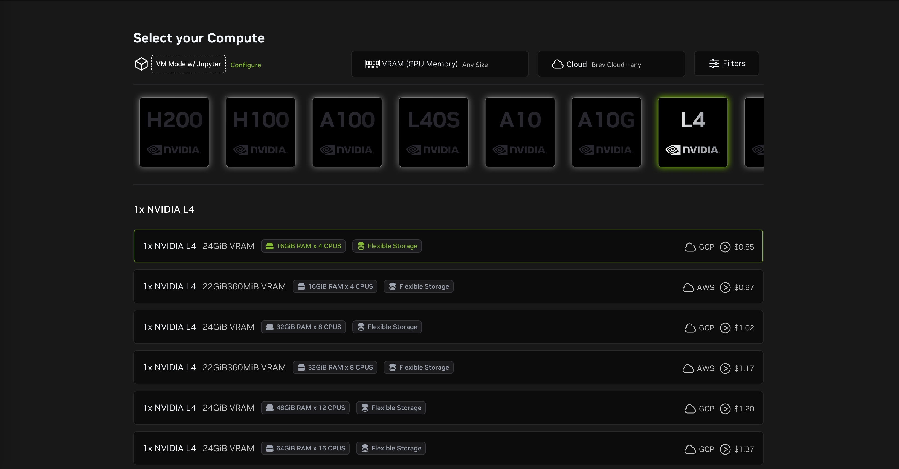

# Setup

## Requirements

### Software

This tutorial requires minimal software to be installed in advance:

* A computer running an 64 bit version of Linux, macOS, or Windows.
   - At the moment a laptop is required and an ARM based tablet will not be sufficient.
* [Pixi](https://pixi.sh/)
* [Git](https://git-scm.com/) (optional, but encouraged)

### Hardware (optional)

* An NVIDIA GPU

This tutorial focuses on hardware acceleration for {term}`CUDA` environments which require an NVIDIA GPU to use.
While an NVIDIA GPU is not required to be able to work through the tutorial, access to one will be required to run the examples.

:::{important} SciPy 2025 in-person tutorial resources

For the [in-person tutorial at SciPy 2025](https://cfp.scipy.org/scipy2025/talk/GDN8PN/) (on 2025-07-07) NVIDIA has donated GPU resources through an [NVIDIA Brev platform](https://developer.nvidia.com/brev).
Tutorial participants will be given a code to use at the start of the tutorial by the instructors.
You must be in-person at the tutorial to receive the code.

:::


### Web Platforms (optional, but encouraged)

* [GitHub](https://github.com/)

For this tutorial we would like you to create your own Git repository where you add the results of your work as you move through the tutorial so that you have a sharable form of what you have learned by the end.
It doesn't _need_ to be GitHub (GitLab.com or some other alternative exist) but for the sake of consistency, the instructions will assume you are using GitHub.

::: {attention} GitHub mandatory two-factor authentication

As [GitHub requires two-factor authentication](https://docs.github.com/en/authentication/securing-your-account-with-two-factor-authentication-2fa/about-mandatory-two-factor-authentication), it is highly recommended that you [generate an SSH key pair](https://docs.github.com/en/authentication/connecting-to-github-with-ssh/generating-a-new-ssh-key-and-adding-it-to-the-ssh-agent) specifically for GitHub, [add the generated SSH key to your GitHub account](https://docs.github.com/en/authentication/connecting-to-github-with-ssh/adding-a-new-ssh-key-to-your-github-account), and then use your SSH keys to connect with GitHub.

:::

## Installation

(install-pixi)=
### Pixi

To install Pixi follow [the installation instructions](https://pixi.sh/latest/#installation) for your particular machine and then restart your shell.

::::{tab-set}

:::{tab-item} Unix (Linux and macOS) and Windows Terminal
:sync: tab1

```bash
curl -fsSL https://pixi.sh/install.sh | sh
```

:::

:::{tab-item} Windows PowerShell
:sync: tab2

```powershell
powershell -ExecutionPolicy ByPass -c "irm -useb https://pixi.sh/install.ps1 | iex"
```

:::

::::

#### Pixi Shell completions

Additionally, install the [Pixi shell completions](https://pixi.sh/latest/advanced/installation/#autocompletion) for your particular shell choice.

### Git

You probably already have Git installed on your machine.
You can check with

```bash
command -v git
```

If the command doesn't return a filepath to the `git` executable, first make sure you have [Pixi installed](#install-pixi), as described above, and then run

```bash
pixi global install git
```

You can now use the Git anywhere on your machine.

### Brev

#### Brev CLI

::: {warning} Brev on Windows
:class: dropdown

As described in the [Brev docs](https://docs.nvidia.com/brev/latest/brev-cli.html#installation-instructions)

> Brev is supported on Windows currently through the Windows Subsystem for Linux (WSL).

To participate in the GPU component of the workshop with Brev on a Windows machine make sure that you have

* [WSL](https://learn.microsoft.com/en-us/windows/wsl/install) installed and configured
* Virtualization enabled in your BIOS
* [Ubuntu 20.04](https://www.microsoft.com/en-us/p/ubuntu-2004-lts/9n6svws3rx71?activetab=pivot:overviewtab) installed from the Microsoft Store

:::


For the portion of the tutorial where GPUs will be used we'll be working on an [NVIDIA Brev instance](https://developer.nvidia.com/brev).
To install the CLI API for Brev, we'll use [`pixi global`](https://pixi.sh/latest/global_tools/introduction/) so make sure you first have [Pixi installed](#install-pixi), as described above, and then run

```bash
pixi global install brev
```

You can now use the Brev CLI anywhere on your machine.
Check out the CLI options with

```bash
brev --help
```

#### Create an NVIDIA Brev account

To access the NVIDIA Brev instance you'll also need to create an NVIDIA Brev account.

* Visit https://login.brev.nvidia.com/signin and fill in your email address and agree to the terms of use.
* Check your email address that you used to create the account for verification email with further instructions.

#### Login to Brev account with Brev CLI

To validate your Brev account and your Brev CLI install, login to your Brev account from the command line with [`brev login`](https://docs.nvidia.com/brev/latest/brev-cli.html#login).

```bash
brev login
```

::: {tip} Login info

1. You'll be prompted to either enter or confirm the email address associated with your NVIDIA Brev account.
1. You'll then be prompted to login to your account via a browser where you can provide your authentication credentials.
1. Upon login success you'll be shown your Brev account on the GPUs tab.

:::

#### Provisioning environments

Later on in the [SciPy 2025 tutorial](https://cfp.scipy.org/scipy2025/talk/GDN8PN/), we'll use a coupon code to provision a [new Brev GPU instance environment](https://brev.nvidia.com/environment/new).
The particular configuration for the code is:
* 1x NVIDIA L4 GPU
* 24GiB VRAM
* 16GiB Ram x 4 CPUS
* GCP

[](https://brev.nvidia.com/environment/new)

### GitHub Repository Setup

1. Create a personal [GitHub account](https://github.com/) if you don’t have one yet.
1. Navigate to your GitHub profile (https://github.com/) and click the "`+`" icon in the upper right hand side to create a new repository.
1. Name the new repository `reproducible-ml-for-scientists-tutorial-scipy-2025`, make it public, and give it a README and an [open source license](https://docs.github.com/repositories/managing-your-repositorys-settings-and-features/customizing-your-repository/licensing-a-repository) (e.g. MIT License).
